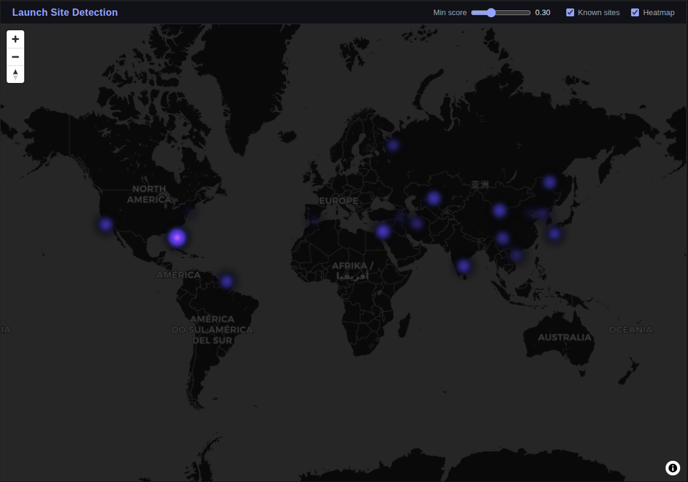
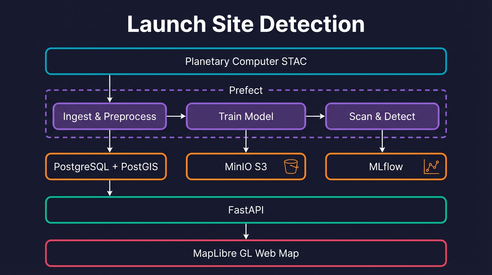

# Launch Site Detection (OSINT)

Geospatial ML pipeline that detects static missile/rocket launch sites from open satellite imagery (Sentinel-2 + Sentinel-1). Candidates are surfaced through a FastAPI backend and explored on an interactive MapLibre web map.

<p align="center">
  
</p>

---

## Table of contents

1. [Data](#data)
2. [ML model](#ml-model)
3. [Model serving (Triton)](#model-serving-triton)
4. [Pipeline](#pipeline)
5. [API](#api)
6. [Web app](#web-app)
7. [Infrastructure & tooling](#infrastructure--tooling)
8. [Benchmarking](#benchmarking)
9. [Hardware requirements](#hardware-requirements)
10. [Repository structure](#repository-structure)
11. [Quick start](#quick-start)

---

## Data

### Sources

| Sensor | Collection | Resolution | Bands used |
|---|---|---|---|
| **Sentinel-2 L2A** (optical) | `sentinel-2-l2a` | 10 m | B02, B03, B04 (visible), B08 (NIR), B11/B12 (SWIR) |
| **Sentinel-1 RTC** (SAR, optional) | `sentinel-1-rtc` | 10 m | VV, VH |

All imagery is discovered and downloaded via the [Microsoft Planetary Computer](https://planetarycomputer.microsoft.com/api/stac/v1) STAC API as Cloud-Optimized GeoTIFFs (COGs).

### Processing chain

1. **STAC search** — query by AOI bounding box and date range, download cropped scenes in parallel.
2. **Cloud masking** — Sentinel-2 Scene Classification Layer (SCL) keeps only clear-sky pixels (classes 4-7).
3. **Temporal compositing** — pixel-wise median (or mean) across the time window to produce a single cloud-free mosaic.
4. **Radiometric normalisation** — per-band 2nd–98th percentile stretch to `[0, 1]`.
5. **Spectral indices** — NDVI, NDWI, NDBI and BSI are appended, expanding 6 raw bands to **10 input channels**.
6. **Tiling** — composites are cut into **256 × 256 px** chips (2.56 km² at 10 m GSD) with a 32 px overlap.
7. **Weak label generation** — binary masks derived from known launch-site buffers (default 2 km radius), with values `{0, 0.5, 1}`.

### Storage layout

```
data/
  raw/{aoi}/sentinel2/    # downloaded GeoTIFFs
  composites/             # temporal median composites
  tiles/{aoi}/            # 256×256 chips + label masks
  predictions/            # single-band probability rasters (float32)
  manifests/              # dataset split JSONs, AOI configs, known-sites list
```

Metadata and detections live in **PostgreSQL + PostGIS** (EPSG 4326). Object storage for rasters is provided by **MinIO**.

---

## ML model

### Architecture

The default model is a **UNet with a ResNet-34 encoder** (ImageNet-pretrained) built with [`segmentation-models-pytorch`](https://github.com/qubvel-org/segmentation_models.pytorch). An alternative **DeepLabV3+ (ResNet-50)** is also available for a larger receptive field.

| Parameter | Value |
|---|---|
| Input shape | `(10, 256, 256)` — 6 bands + 4 indices |
| Output | 1-channel sigmoid probability map |
| Encoder weights | ImageNet |
| Framework | PyTorch Lightning ≥ 2.2 |

An experimental `DualEncoderUNet` (separate optical + SAR branches) is defined but not used in the default pipeline.

### Training

| Setting | Value |
|---|---|
| Optimiser | AdamW — lr 1e-3, weight decay 1e-4 |
| LR schedule | ReduceLROnPlateau — patience 5, factor 0.5 |
| Loss | **Focal** (α 0.25, γ 2.0, label smoothing 0.05) **+ Dice** (weight 0.5) |
| Batch size | 16 |
| Max epochs | 50 |
| Precision | mixed-16 on GPU, 32-bit on CPU |
| Augmentation | random 90° rotations, horizontal & vertical flips |
| Data split | 70 % train / 15 % val / 15 % test (stratified by positive/negative) |
| Callbacks | ModelCheckpoint (top-3), EarlyStopping (patience 10) |
| Tracking | MLflow (`http://localhost:5000`) |

### Inference

- **Sliding window** over the full composite: 256 × 256 tiles, 64 px overlap, batches of 8.
- Output probability raster → threshold at 0.5 → connected components → polygonisation.
- Candidate polygons are scored by mean probability, area and compactness, then deduplicated with DBSCAN.
- Two inference backends are available: **local** (in-process PyTorch, the default fallback) and **Triton** (remote NVIDIA Triton Inference Server with dynamic batching). See [Model serving](#model-serving-triton) below.

---

## Model serving (Triton)

The inference path can be offloaded to [NVIDIA Triton Inference Server](https://developer.nvidia.com/triton-inference-server), which provides GPU-accelerated model serving with automatic request batching. This decouples model execution from the pipeline client and improves throughput for large-area scans.

### ONNX export

The trained Lightning checkpoint is exported to ONNX with a dynamic batch axis so Triton can batch incoming tile requests server-side:

```bash
python -m services.serving.export_model \
    --checkpoint checkpoints/best.ckpt \
    --output model_repository/unet_seg/1/model.onnx
```

The export step validates the ONNX model by comparing its output against PyTorch (atol = 1e-5) and tests dynamic batch sizes from 1 to 32.

### Model repository

Triton loads the model from the `model_repository/` directory at the project root:

```
model_repository/
  unet_seg/
    config.pbtxt       # model config (ONNX Runtime backend, dynamic batching)
    1/
      model.onnx       # exported model (created by export step above)
```

The `config.pbtxt` configures:

| Setting | Value |
|---|---|
| Backend | ONNX Runtime |
| Max batch size | 32 |
| Dynamic batching | Preferred sizes 8, 16, 32 — max queue delay 50 ms |
| Instance group | 1 × GPU |
| Input | `(B, 10, 256, 256)` float32 |
| Output | `(B, 1, 256, 256)` float32 (logits; sigmoid applied client-side) |

### Triton client

`services/serving/triton_client.py` provides two client classes:

- **`TritonSegClient`** — synchronous gRPC client with retry logic and exponential backoff. Used by the pipeline tasks.
- **`AsyncTritonSegClient`** — async gRPC client for concurrent tile submission.

Both clients construct Triton `InferInput`/`InferRequestedOutput` tensors, send batches over gRPC, and apply sigmoid to the returned logits.

The function `triton_sliding_window_inference()` is a drop-in replacement for the original `sliding_window_inference()` — same windowing, overlap accumulation and GeoTIFF output, but inference is handled by Triton instead of a local PyTorch model.

### Memory-optimised inference

For large-area satellite scans (e.g. a 1-degree AOI at 10 m GSD ≈ 11,000 × 11,000 px), the standard in-memory `prob_map` / `count_map` arrays consume ~0.9 GB of RAM. `services/serving/memory_optimized.py` addresses this with:

- **Memory-mapped accumulation** — `prob_map` and `count_map` use `np.memmap` backed by temporary files, letting the OS manage paging.
- **Horizontal strip processing** — the raster is processed in strips whose height is auto-tuned to fit within a configurable memory budget (`max_memory_mb`, default 512 MB).
- **Streaming tile reader** — tiles are read, preprocessed, sent to Triton and discarded immediately; no tile list is accumulated in memory.

### Running Triton locally

```bash
# 1. Export the model
python -m services.serving.export_model --checkpoint checkpoints/best.ckpt

# 2. Start Triton (requires nvidia-container-toolkit)
docker compose -f infra/docker-compose.yml up -d triton

# 3. Verify readiness
curl http://localhost:8000/v2/health/ready       # HTTP 200
curl http://localhost:8000/v2/models/unet_seg     # model metadata

# 4. Run inference via Triton
TRITON_URL=localhost:8001 python -m services.pipeline.flows detect --serving-mode triton
```

For CPU-only testing, edit `model_repository/unet_seg/config.pbtxt` and change `KIND_GPU` to `KIND_CPU`, then run the Triton container without GPU reservation.

---

## Pipeline

The orchestration layer uses [Prefect](https://www.prefect.io/) (≥ 2.14). Four flows can be run individually or chained.

```
┌─────────────────────┐     ┌──────────────────┐     ┌─────────────────────┐
│  ingest-and-        │     │  train-model-     │     │  scan-and-detect-   │
│  preprocess-flow    │────▶│  flow             │────▶│  flow               │
│                     │     │                   │     │                     │
│  STAC download      │     │  Lightning train  │     │  Sliding-window     │
│  Cloud mask         │     │  MLflow logging   │     │  inference          │
│  Composite          │     │  Returns best     │     │  Postprocess        │
│  Tile + labels      │     │  checkpoint path  │     │  Store in PostGIS   │
└─────────────────────┘     └──────────────────┘     └─────────────────────┘

                    full-pipeline-flow (end-to-end)
                    supports --skip-ingest / --skip-training
```

### Key tasks

| Task | Retries | Purpose |
|---|---|---|
| `ingest_aoi_task` | 2 | STAC search + parallel download |
| `build_composite_task` | 0 | Temporal median/mean compositing |
| `tile_composite_task` | 0 | 256×256 tiling with overlap |
| `build_labels_task` | 0 | Weak-label mask generation |
| `train_model_task` | 0 | PyTorch Lightning training loop |
| `run_inference_task` | 0 | Batch sliding-window prediction (local PyTorch) |
| `run_triton_inference_task` | 0 | Sliding-window prediction via Triton (standard or memory-optimised) |
| `postprocess_task` | 0 | Threshold, extract, score, deduplicate |
| `store_detections_task` | 0 | Insert polygons into PostGIS |

The `scan_and_detect_flow` accepts a `--serving-mode` flag (`local` or `triton`). When omitted, it auto-detects: if the `TRITON_URL` environment variable is set, Triton is used; otherwise inference falls back to local PyTorch.

```bash
python -m services.pipeline.flows [full|ingest|train|detect]

# Detect with Triton
python -m services.pipeline.flows detect --serving-mode triton --triton-url localhost:8001

# Or via environment variable
TRITON_URL=localhost:8001 python -m services.pipeline.flows detect
```

---

## API

A **FastAPI** (≥ 0.110) application served by Uvicorn. CORS is open for local development. The database layer uses SQLAlchemy + GeoAlchemy2.

### Endpoints

| Method | Path | Description |
|---|---|---|
| `GET` | `/health` | Status, version, detection count, Triton readiness (when `TRITON_URL` is set) |
| `GET` | `/detections` | List detections — filter by bounding box, `min_score` (0-1), `limit`, `offset` |
| `GET` | `/detections/{id}` | Single detection with full GeoJSON geometry |
| `GET` | `/known-sites` | All reference launch sites (name, country, coordinates) |
| `GET` | `/evidence/{id}` | Evidence metadata (score, model version, geometry, JSONB payload) |
| `GET` | `/evidence/{id}/thumbnail` | False-colour RGB thumbnail (PNG, 256×256 default, configurable 64-1024 px) |
| `GET` | `/tiles/{z}/{x}/{y}.pbf` | Mapbox Vector Tiles generated on-the-fly via `ST_AsMVT` (score ≥ 0.1, 1 h cache) |

### Data models (PostGIS)

| Table | Key columns |
|---|---|
| `detections` | `geom` (POLYGON), `score`, `model_version`, `evidence` (JSONB), `area_km2`, `compactness` |
| `known_sites` | `geom` (POINT), `buffer_geom` (POLYGON), `name`, `country`, `source` |
| `imagery_catalog` | `scene_id`, `sensor`, `acquired_date`, `bbox`, `cloud_cover_pct`, `cog_path` |

```bash
uvicorn services.api.main:app --reload
```

---

## Web app

An interactive single-page map built with **MapLibre GL** (≥ 4.1) and bundled by **Vite** (≥ 5.4).

### Map layers

| Layer | Rendering | Details |
|---|---|---|
| **Basemap** | CARTO Dark Matter raster tiles | Dark theme for contrast |
| **Detections** | Score-scaled circles (4-12 px) | Gray → Amber → Red as score rises (0 → 0.9+) |
| **Heatmap** (toggle) | Purple gradient | Alternative view of detection density |
| **Known sites** (toggle) | Cyan circles + labels | Reference launch sites with name & country |

Detection circles and the heatmap are fed by the MVT vector-tile endpoint for efficient rendering at any zoom level.

### Controls

- **Score slider** — filter visible detections by minimum confidence (0.0–1.0).
- **Known-sites toggle** — show or hide the reference site layer.
- **Heatmap toggle** — switch between individual circles and a density heatmap.

### Detail panel

Clicking a detection opens a side panel showing:

- Detection ID, confidence score, area (km²), compactness
- Model version and detection date
- Centroid coordinates
- False-colour evidence thumbnail fetched from `/evidence/{id}/thumbnail`

### Data flow

1. On load — fetch known sites and detections for the initial viewport.
2. On pan/zoom — re-fetch detections for the new bounding box.
3. Vector tiles stream in from `/tiles/{z}/{x}/{y}.pbf` as the user navigates.

```bash
cd services/web && npm install && npm run dev
```

---

## Infrastructure & tooling

<p align="center">
  
</p>

Everything runs locally via a single `docker compose` file (`infra/docker-compose.yml`) that spins up four services.

### Docker Compose services

| Service | Image | Ports | Role |
|---|---|---|---|
| **PostgreSQL + PostGIS** | `postgis/postgis:16-3.4` | `5432` | Relational store for detections, known sites, imagery catalog and tiles. PostGIS enables spatial queries (`ST_AsMVT`, GIST indexes). Initialised automatically by `infra/postgres-init/001_schema.sql`. |
| **MinIO** | `minio/minio:latest` | `9000` (S3 API), `9001` (console) | S3-compatible object store. Holds raw GeoTIFFs, composites and MLflow model artefacts. Default bucket: `imagery`. |
| **MLflow** | `ghcr.io/mlflow/mlflow:v2.10.0` | `5000` | Experiment tracker. Backend store in Postgres, artefact store in MinIO (`s3://mlflow-artifacts/`). Logs metrics, hyperparameters and model checkpoints for every training run. |
| **Triton Inference Server** | `nvcr.io/nvidia/tritonserver:24.01-py3` | `8000` (HTTP), `8001` (gRPC), `8002` (Prometheus metrics) | GPU-accelerated model serving with dynamic request batching. Loads the ONNX UNet from `model_repository/unet_seg/`. Requires `nvidia-container-toolkit`. |

Data volumes (`pgdata`, `minio_data`) are persisted across restarts.

### Configuration

All connection strings are centralised in `libs/config.py` via a `pydantic-settings` `BaseSettings` class. Defaults point to the Docker Compose services; override with a `.env` file or environment variables.

| Variable | Default | Description |
|---|---|---|
| `POSTGRES_HOST` | `localhost` | Database host |
| `POSTGRES_PORT` | `5432` | Database port |
| `POSTGRES_DB` | `launchsite` | Database name |
| `MINIO_ENDPOINT` | `localhost:9000` | MinIO S3 endpoint |
| `MINIO_BUCKET` | `imagery` | Default bucket for rasters |
| `MLFLOW_TRACKING_URI` | `http://localhost:5000` | MLflow server URL |
| `TRITON_URL` | *(unset)* | Triton gRPC endpoint (e.g. `localhost:8001`). When set, the pipeline and health endpoint use Triton automatically. |

### Tooling overview

| Tool | Version | Purpose |
|---|---|---|
| [Prefect](https://www.prefect.io/) | ≥ 2.14 | Workflow orchestration — defines flows and tasks with retries, logging and dependency management. |
| [MLflow](https://mlflow.org/) | ≥ 2.10 | Experiment tracking — logs training metrics (F1, AUROC, loss curves), hyperparameters and model checkpoints. |
| [PyTorch Lightning](https://lightning.ai/) | ≥ 2.2 | Training framework — handles the training loop, mixed-precision, callbacks (checkpoint, early stopping) and multi-GPU. |
| [segmentation-models-pytorch](https://github.com/qubvel-org/segmentation_models.pytorch) | ≥ 0.3.3 | Pretrained encoder architectures (ResNet-34/50) and segmentation heads (UNet, DeepLabV3+). |
| [NVIDIA Triton Inference Server](https://developer.nvidia.com/triton-inference-server) | 24.01 | GPU model serving with dynamic request batching, gRPC/HTTP endpoints and Prometheus metrics. |
| [ONNX](https://onnx.ai/) / ONNX Runtime | ≥ 1.15 / ≥ 1.17 | Model interchange format and inference engine used as the Triton backend. |
| [tritonclient](https://github.com/triton-inference-server/client) | ≥ 2.42 | Python gRPC/HTTP client for communicating with Triton Inference Server. |
| [pystac-client](https://pystac-client.readthedocs.io/) | ≥ 0.8 | STAC API client for discovering Sentinel scenes on Microsoft Planetary Computer. |
| [rasterio](https://rasterio.readthedocs.io/) / rioxarray | ≥ 1.3 | GeoTIFF I/O, reprojection, windowed reads. |
| [GeoPandas](https://geopandas.org/) / Shapely | ≥ 0.14 | Vector geometry operations (buffering, intersection, polygonisation). |
| [FastAPI](https://fastapi.tiangolo.com/) + Uvicorn | ≥ 0.110 | Async HTTP API with auto-generated OpenAPI docs. |
| [SQLAlchemy](https://www.sqlalchemy.org/) + GeoAlchemy2 | ≥ 2.0 | ORM with spatial column support for PostGIS. |
| [MapLibre GL](https://maplibre.org/) | ≥ 4.1 | WebGL map rendering in the browser (vector tiles, GeoJSON, heatmaps). |
| [Vite](https://vitejs.dev/) | ≥ 5.4 | Frontend dev server and production bundler. |

### Database schema

Four tables are created at first boot by `001_schema.sql`:

```
imagery_catalog   scenes discovered via STAC (scene_id, sensor, date, bbox, COG path)
tiles             256×256 chips with train/val/test split
detections        model output polygons with score, area and evidence JSONB
known_sites       reference launch sites with point + buffer geometries
```

All geometry columns use EPSG 4326 and are GIST-indexed for fast spatial lookups.

---

## Benchmarking

A benchmark harness in `benchmarks/inference_benchmark.py` compares inference throughput, latency and memory usage across three modes:

| Mode | Description |
|---|---|
| `baseline` | Original in-process PyTorch sliding window (CPU or GPU) |
| `triton` | Triton Inference Server with dynamic batching |
| `triton_memopt` | Triton + memory-mapped accumulation + strip processing |

### Running benchmarks

```bash
# Baseline only (no Triton needed)
python -m benchmarks.inference_benchmark \
    --modes baseline \
    --checkpoint checkpoints/best.ckpt \
    --device cpu \
    --raster-sizes 1024,4096 \
    --batch-sizes 8,16

# Full comparison (Triton must be running)
python -m benchmarks.inference_benchmark \
    --modes baseline,triton,triton_memopt \
    --checkpoint checkpoints/best.ckpt \
    --triton-url localhost:8001 \
    --device cuda \
    --raster-sizes 1024,4096,11000 \
    --batch-sizes 1,8,16,32 \
    --overlaps 0,32,64
```

When `--raster` is omitted, synthetic multi-band GeoTIFFs are generated automatically at the requested sizes.

### Metrics collected

| Metric | Source |
|---|---|
| Wall-clock time, tiles/sec | `time.perf_counter` |
| Per-batch latency (p50 / p95 / p99) | Timed per Triton gRPC call |
| Peak RSS | `resource.getrusage` |
| Peak Python allocations | `tracemalloc` |
| GPU utilisation | `pynvml` (when available) |

Results are saved to `benchmarks/results/benchmark_results.json` and printed as a summary table.

---

## Hardware requirements

The full pipeline (ingest + train + detect) is **not designed for a laptop**. While the API, web map and Docker services are lightweight, the data volumes and compute demands of ingestion and training require a proper workstation or cloud VM.

### Data volume estimates

The default AOI config defines four regions totalling ~33,000 km² of ground coverage. At 10 m GSD with up to 50 Sentinel-2 scenes per AOI over a 6-month window:

| Stage | Per AOI | 4 AOIs (total) |
|---|---|---|
| Raw scene downloads (6 bands, uint16, deflate) | 25–40 GB | **80–150 GB** |
| Temporal composites (float32, 6 bands) | 1–3 GB | ~5–10 GB |
| Tiles (256×256, 10 channels float32) + labels | 3–6 GB | ~10–20 GB |
| Predictions + PostGIS + MLflow artifacts | 1–2 GB | ~3–5 GB |
| **Total disk footprint** | | **~100–180 GB** |

### Compute bottlenecks

| Stage | What hurts | Why |
|---|---|---|
| **Ingestion** | Network I/O, disk | Downloads tens of GB from Planetary Computer via concurrent HTTP reads (4 scenes × 6 bands in parallel). |
| **Compositing** | RAM | Loads all scenes for an AOI into memory for pixel-wise median — the largest AOI (Baikonur, ~12,700 km²) can require 30–60 GB of RAM. |
| **Training** | GPU (or CPU time) | ResNet-34 UNet, 10-channel 256×256 tiles, batch 16, up to 50 epochs. On CPU this takes hours to days; on a mid-range GPU it finishes in under an hour. |
| **Inference** | GPU (or CPU time) | Sliding window over full composites produces thousands of 256×256 patches per AOI. |

### Minimum and recommended specs

| Resource | Minimum (will be slow) | Recommended |
|---|---|---|
| **GPU** | None (CPU-only, `gpus=0`) | NVIDIA GPU with ≥ 8 GB VRAM (e.g. RTX 3060 12 GB, T4, A10G) |
| **RAM** | 16 GB | 32–64 GB |
| **Disk** | 200 GB free (SSD) | 500 GB+ SSD |
| **CPU** | 4 cores | 8+ cores (helps with data loaders and parallel downloads) |
| **Network** | Broadband | ≥ 100 Mbps (large COG downloads from Planetary Computer) |

### Suggested cloud instances

| Provider | Instance | GPU | RAM | Notes |
|---|---|---|---|---|
| AWS | `g5.2xlarge` | A10G 24 GB | 32 GB | Good balance of GPU and RAM |
| GCP | `n1-standard-8` + T4 | T4 16 GB | 30 GB | Attach a 500 GB persistent SSD |
| Azure | `Standard_NC8as_T4_v3` | T4 16 GB | 56 GB | Generous RAM for compositing |

### What runs fine on a laptop

The **API + web map** are lightweight and work well on any machine. For local development without running the pipeline, use the minimal quick start (`--skip-ingest --skip-training`) with pre-computed data or an empty database.

---

## Repository structure

```
services/
  api/            # FastAPI endpoints + SQLAlchemy models
  pipeline/       # Prefect flows & tasks (local + Triton inference)
  training/       # PyTorch Lightning training, model definitions, inference
  serving/        # Triton client, ONNX export, memory-optimised inference
  web/            # MapLibre + Vite frontend
libs/
  geo/            # Tiling, projections, cloud masks, postprocessing
  stac/           # STAC discovery + download client
  features/       # Spectral indices (NDVI, NDWI, NDBI, BSI)
  config.py       # Central settings (Postgres, MinIO, MLflow)
infra/
  docker-compose.yml   # Postgres/PostGIS, MinIO, MLflow, Triton
  postgres-init/       # SQL schema (001_schema.sql)
model_repository/
  unet_seg/       # Triton model config + ONNX model (version 1/)
benchmarks/
  inference_benchmark.py   # Throughput / latency / memory comparison harness
  results/                 # JSON benchmark output
data/
  manifests/      # Dataset splits, AOI configs, known-sites list
```

---

## Quick start

### Minimal (API + web map only, no pipeline)

Useful to explore the UI or develop against an empty (or pre-seeded) database without waiting for imagery ingestion and training.

```bash
# 1. Start only Postgres/PostGIS (schema is applied automatically)
docker compose -f infra/docker-compose.yml up -d postgres

# 2. Install Python dependencies
pip install -r requirements.txt

# 3. Start the API
uvicorn services.api.main:app --reload

# 4. Start the web UI
cd services/web && npm install && npm run dev
```

The map will load with known sites from `data/manifests/known_sites.json`. The detections layer will be empty until you either run the pipeline or insert rows into the `detections` table manually.

### Full (ingest, train, detect, serve)

```bash
# 1. Infrastructure (Postgres/PostGIS, MinIO, MLflow)
docker compose -f infra/docker-compose.yml up -d postgres minio mlflow

# 2. Install Python dependencies
pip install -r requirements.txt

# 3. Run the full pipeline (ingest → train → detect)
python -m services.pipeline.flows full

# 4. Start the API
uvicorn services.api.main:app --reload

# 5. Start the web UI
cd services/web && npm install && npm run dev
```

Individual pipeline stages can also be run separately:

```bash
python -m services.pipeline.flows ingest   # download + preprocess only
python -m services.pipeline.flows train    # train model only
python -m services.pipeline.flows detect   # inference + postprocess only
```

### With Triton Inference Server

```bash
# 1. Export trained model to ONNX
python -m services.serving.export_model --checkpoint checkpoints/best.ckpt

# 2. Start all infrastructure including Triton (requires nvidia-container-toolkit)
docker compose -f infra/docker-compose.yml up -d

# 3. Run detection with Triton-backed inference
TRITON_URL=localhost:8001 python -m services.pipeline.flows detect

# 4. Start the API (Triton health is reported at /health)
TRITON_URL=localhost:8001 uvicorn services.api.main:app --reload
```

### Benchmark inference modes

```bash
# Compare baseline vs. Triton (Triton must be running)
python -m benchmarks.inference_benchmark \
    --modes baseline,triton,triton_memopt \
    --checkpoint checkpoints/best.ckpt \
    --triton-url localhost:8001 \
    --raster-sizes 1024,4096
```
